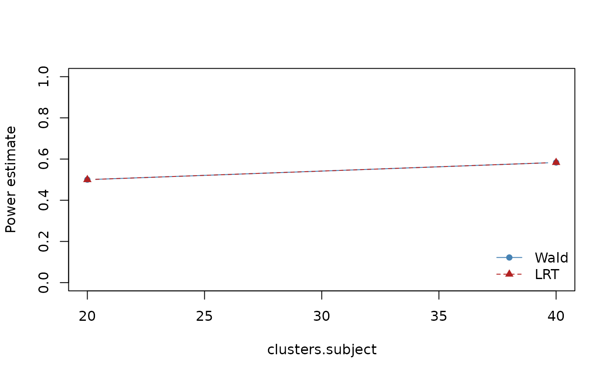

# mixpower intro

``` r
library(mixpower)
```

mixpower provides simulation-based power analysis for Gaussian linear
mixed-effects models.

## Inference options: Wald vs LRT

MixPower supports two inferential paths in the `lme4` backend:

- `"wald"` (default): coefficient z-test from fixed-effect estimate and
  its SE.
- `"lrt"`: likelihood-ratio test between explicit null and full models.

For LRT, you must provide `null_formula` explicitly. This avoids hidden
model-reduction rules and keeps assumptions transparent.

``` r
d <- mp_design(clusters = list(subject = 20), trials_per_cell = 6)
a <- mp_assumptions(
  fixed_effects = list(`(Intercept)` = 0, condition = 0.4),
  residual_sd = 1,
  random_effects = list(subject = list(intercept_sd = 0.1))
)

scn_wald <- mp_scenario_lme4(
  y ~ condition + (1 | subject),
  design = d,
  assumptions = a,
  test_method = "wald"
)

scn_lrt <- mp_scenario_lme4(
  y ~ condition + (1 | subject),
  design = d,
  assumptions = a,
  test_method = "lrt",
  null_formula = y ~ 1 + (1 | subject)
)

vary_spec <- list(`clusters.subject` = c(20, 40))

sens_wald <- mp_sensitivity(
  scn_wald,
  vary = vary_spec,
  nsim = 12,
  seed = 123
)
#> boundary (singular) fit: see help('isSingular')
#> boundary (singular) fit: see help('isSingular')
#> boundary (singular) fit: see help('isSingular')
#> boundary (singular) fit: see help('isSingular')
#> boundary (singular) fit: see help('isSingular')
#> boundary (singular) fit: see help('isSingular')
#> boundary (singular) fit: see help('isSingular')
#> boundary (singular) fit: see help('isSingular')
#> boundary (singular) fit: see help('isSingular')
#> boundary (singular) fit: see help('isSingular')
#> boundary (singular) fit: see help('isSingular')
#> boundary (singular) fit: see help('isSingular')

sens_lrt <- mp_sensitivity(
  scn_lrt,
  vary = vary_spec,
  nsim = 12,
  seed = 123
)
#> boundary (singular) fit: see help('isSingular')
#> boundary (singular) fit: see help('isSingular')
#> boundary (singular) fit: see help('isSingular')
#> boundary (singular) fit: see help('isSingular')
#> boundary (singular) fit: see help('isSingular')
#> boundary (singular) fit: see help('isSingular')
#> boundary (singular) fit: see help('isSingular')
#> boundary (singular) fit: see help('isSingular')
#> boundary (singular) fit: see help('isSingular')
#> boundary (singular) fit: see help('isSingular')
#> boundary (singular) fit: see help('isSingular')
#> boundary (singular) fit: see help('isSingular')
#> boundary (singular) fit: see help('isSingular')
#> boundary (singular) fit: see help('isSingular')
#> boundary (singular) fit: see help('isSingular')
#> boundary (singular) fit: see help('isSingular')
#> boundary (singular) fit: see help('isSingular')
#> boundary (singular) fit: see help('isSingular')
#> boundary (singular) fit: see help('isSingular')
#> boundary (singular) fit: see help('isSingular')
#> boundary (singular) fit: see help('isSingular')
#> boundary (singular) fit: see help('isSingular')
#> boundary (singular) fit: see help('isSingular')
#> boundary (singular) fit: see help('isSingular')
#> boundary (singular) fit: see help('isSingular')
#> boundary (singular) fit: see help('isSingular')
#> boundary (singular) fit: see help('isSingular')
#> boundary (singular) fit: see help('isSingular')
#> boundary (singular) fit: see help('isSingular')
#> boundary (singular) fit: see help('isSingular')
#> boundary (singular) fit: see help('isSingular')
#> boundary (singular) fit: see help('isSingular')
#> boundary (singular) fit: see help('isSingular')
#> boundary (singular) fit: see help('isSingular')
#> boundary (singular) fit: see help('isSingular')
#> boundary (singular) fit: see help('isSingular')

comparison <- rbind(
  transform(sens_wald$results, method = "wald"),
  transform(sens_lrt$results, method = "lrt")
)

comparison[, c(
  "method", "clusters.subject", "estimate", "mcse",
  "conf_low", "conf_high", "failure_rate", "singular_rate"
)]
#>   method clusters.subject  estimate      mcse  conf_low conf_high failure_rate
#> 1   wald               20 0.5000000 0.1443376 0.2109446 0.7890554            0
#> 2   wald               40 0.5833333 0.1423188 0.2766697 0.8483478            0
#> 3    lrt               20 0.5000000 0.1443376 0.2109446 0.7890554            0
#> 4    lrt               40 0.5833333 0.1423188 0.2766697 0.8483478            0
#>   singular_rate
#> 1     0.5833333
#> 2     0.4166667
#> 3     0.5833333
#> 4     0.4166667

wald_dat <- comparison[comparison$method == "wald", ]
lrt_dat  <- comparison[comparison$method == "lrt", ]

plot(
  wald_dat$`clusters.subject`, wald_dat$estimate,
  type = "b", pch = 16, lty = 1,
  ylim = c(0, 1),
  xlab = "clusters.subject",
  ylab = "Power estimate",
  col = "steelblue"
)
lines(
  lrt_dat$`clusters.subject`, lrt_dat$estimate,
  type = "b", pch = 17, lty = 2,
  col = "firebrick"
)
legend(
  "bottomright",
  legend = c("Wald", "LRT"),
  col = c("steelblue", "firebrick"),
  lty = c(1, 2), pch = c(16, 17), bty = "n"
)
```



Interpretation notes:

- Differences in `estimate` reflect inferential method sensitivity under
  the same DGP.
- Compare `failure_rate` and `singular_rate` alongside power; higher
  failures can depress usable inference.
- Keep `nsim` modest in examples, and increase in final study planning
  runs.
- Prefer explicit `null_formula` documentation in reports for LRT
  reproducibility.

## Binary outcomes (binomial GLMM)

MixPower supports binomial GLMM power analysis via the
[`lme4::glmer()`](https://rdrr.io/pkg/lme4/man/glmer.html) backend. This
keeps design assumptions explicit and diagnostics visible.

Extremely large effect sizes can lead to quasi-separation. In those
cases, [`glmer()`](https://rdrr.io/pkg/lme4/man/glmer.html) may warn or
return unstable estimates. MixPower records these as failed simulations
(via `NA` p-values), preserving transparency.

``` r
d <- mp_design(clusters = list(subject = 20), trials_per_cell = 6)
a <- mp_assumptions(
  fixed_effects = list(`(Intercept)` = 0, condition = 0.5),
  residual_sd = 1,
  random_effects = list(subject = list(intercept_sd = 0.4))
)

scn_bin <- mp_scenario_lme4_binomial(
  y ~ condition + (1 | subject),
  design = d,
  assumptions = a,
  test_method = "wald"
)

res_bin <- mp_power(scn_bin, nsim = 12, seed = 123)
#> boundary (singular) fit: see help('isSingular')
#> boundary (singular) fit: see help('isSingular')
#> boundary (singular) fit: see help('isSingular')
summary(res_bin)
#> $power
#> [1] 0.08333333
#> 
#> $mcse
#> [1] 0.07978559
#> 
#> $ci
#> [1] 0.002107593 0.384796165
#> 
#> $ci_method
#> [1] "clopper-pearson"
#> 
#> $diagnostics
#> $diagnostics$fail_rate
#> [1] 0
#> 
#> $diagnostics$singular_rate
#> [1] 0.25
#> 
#> $diagnostics$type_s
#> [1] 0
#> 
#> $diagnostics$type_m
#> [1] 2.663587
#> 
#> 
#> $nsim
#> [1] 12
#> 
#> $alpha
#> [1] 0.05
#> 
#> $failure_policy
#> [1] "count_as_nondetect"
#> 
#> $conf_level
#> [1] 0.95
```

## Sensitivity curve for binomial outcomes

``` r
sens_bin <- mp_sensitivity(
  scn_bin,
  vary = list(`fixed_effects.condition` = c(0.2, 0.6)),
  nsim = 12,
  seed = 123
)
#> boundary (singular) fit: see help('isSingular')
#> boundary (singular) fit: see help('isSingular')
#> boundary (singular) fit: see help('isSingular')
#> boundary (singular) fit: see help('isSingular')
#> boundary (singular) fit: see help('isSingular')
#> boundary (singular) fit: see help('isSingular')
#> boundary (singular) fit: see help('isSingular')

plot(sens_bin)
```


``` r
sens_bin$results
#>   fixed_effects.condition  estimate      mcse   conf_low conf_high failure_rate
#> 1                     0.2 0.1666667 0.1075829 0.02086253 0.4841377            0
#> 2                     0.6 0.2500000 0.1250000 0.05486064 0.5718585            0
#>   singular_rate n_effective nsim
#> 1     0.2500000          12   12
#> 2     0.3333333          12   12

# Inspect failure_rate and singular_rate alongside power.
# Increase nsim for final study reporting.
```

## Count outcomes (Poisson vs Negative Binomial)

MixPower supports count outcomes through Poisson and Negative Binomial
GLMMs. Poisson is appropriate when variance ≈ mean; NB handles
over-dispersion.

``` r
d <- mp_design(clusters = list(subject = 20), trials_per_cell = 6)
a <- mp_assumptions(
  fixed_effects = list(`(Intercept)` = 0, condition = 0.4),
  residual_sd = 1,
  random_effects = list(subject = list(intercept_sd = 0.3))
)

scn_pois <- mp_scenario_lme4_poisson(
  y ~ condition + (1 | subject),
  design = d,
  assumptions = a,
  test_method = "wald"
)

res_pois <- mp_power(scn_pois, nsim = 12, seed = 123)
#> boundary (singular) fit: see help('isSingular')
summary(res_pois)
#> $power
#> [1] 0.8333333
#> 
#> $mcse
#> [1] 0.1075829
#> 
#> $ci
#> [1] 0.5158623 0.9791375
#> 
#> $ci_method
#> [1] "clopper-pearson"
#> 
#> $diagnostics
#> $diagnostics$fail_rate
#> [1] 0
#> 
#> $diagnostics$singular_rate
#> [1] 0.08333333
#> 
#> $diagnostics$type_s
#> [1] 0
#> 
#> $diagnostics$type_m
#> [1] 1.18558
#> 
#> 
#> $nsim
#> [1] 12
#> 
#> $alpha
#> [1] 0.05
#> 
#> $failure_policy
#> [1] "count_as_nondetect"
#> 
#> $conf_level
#> [1] 0.95

a_nb <- a
a_nb$theta <- 1.5  # NB dispersion (size parameter)

scn_nb <- mp_scenario_lme4_nb(
  y ~ condition + (1 | subject),
  design = d,
  assumptions = a_nb,
  test_method = "wald"
)

res_nb <- mp_power(scn_nb, nsim = 12, seed = 123)
#> boundary (singular) fit: see help('isSingular')
#> boundary (singular) fit: see help('isSingular')
#> 
#> boundary (singular) fit: see help('isSingular')
#> 
#> boundary (singular) fit: see help('isSingular')
summary(res_nb)
#> $power
#> [1] 0.4166667
#> 
#> $mcse
#> [1] 0.1423188
#> 
#> $ci
#> [1] 0.1516522 0.7233303
#> 
#> $ci_method
#> [1] "clopper-pearson"
#> 
#> $diagnostics
#> $diagnostics$fail_rate
#> [1] 0
#> 
#> $diagnostics$singular_rate
#> [1] 0.3333333
#> 
#> $diagnostics$type_s
#> [1] 0
#> 
#> $diagnostics$type_m
#> [1] 1.574641
#> 
#> 
#> $nsim
#> [1] 12
#> 
#> $alpha
#> [1] 0.05
#> 
#> $failure_policy
#> [1] "count_as_nondetect"
#> 
#> $conf_level
#> [1] 0.95
```

## Sensitivity curves (count outcomes)

``` r
sens_pois <- mp_sensitivity(
  scn_pois,
  vary = list(`fixed_effects.condition` = c(0.2, 0.6)),
  nsim = 12,
  seed = 123
)
#> boundary (singular) fit: see help('isSingular')
#> boundary (singular) fit: see help('isSingular')
#> boundary (singular) fit: see help('isSingular')
#> boundary (singular) fit: see help('isSingular')
#> boundary (singular) fit: see help('isSingular')

sens_nb <- mp_sensitivity(
  scn_nb,
  vary = list(`fixed_effects.condition` = c(0.2, 0.6)),
  nsim = 12,
  seed = 123
)
#> boundary (singular) fit: see help('isSingular')
#> boundary (singular) fit: see help('isSingular')
#> 
#> boundary (singular) fit: see help('isSingular')
#> 
#> boundary (singular) fit: see help('isSingular')
#> 
#> boundary (singular) fit: see help('isSingular')
#> 
#> boundary (singular) fit: see help('isSingular')
#> 
#> boundary (singular) fit: see help('isSingular')
#> 
#> boundary (singular) fit: see help('isSingular')
#> 
#> boundary (singular) fit: see help('isSingular')

plot(sens_pois)
```


``` r
plot(sens_nb)
```


``` r

# Compare power estimates and failure/singularity rates across Poisson vs NB.
# Overdispersion can reduce power relative to Poisson.
# Increase nsim for final reports.
```
